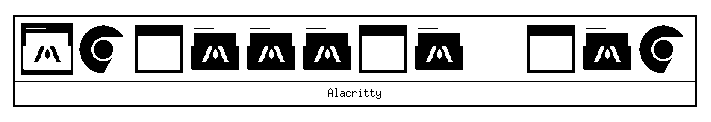

# xtabbie



A simple Alt-Tab window switcher for X11 compatible with TWM.

By DARKGuy

## What is this?

A lightweight Alt-Tab replacement that shows window icons in a grid, Windows 95 style, made 100% with Claude in under an hour. Works with TWM and other minimal window managers that don't have fancy compositing.

Features:
- B&W posterized window icons (or generic icon if none available)
- MRU (Most Recently Used) window ordering - quickly toggle between your two most recent windows
- Daemon mode with global Alt+Tab grab
- Test mode for debugging

## Building

```bash
make
```

## Installation

```bash
sudo make install
```

Or install to a custom location:
```bash
make PREFIX=~/.local install
```

## Uninstall

```bash
sudo make uninstall
```

## Usage

```bash
# Run as daemon (grabs Alt+Tab globally)
xtabbie &

# Test mode (Enter to select, Escape to cancel)
xtabbie --test
```

## License

MIT
